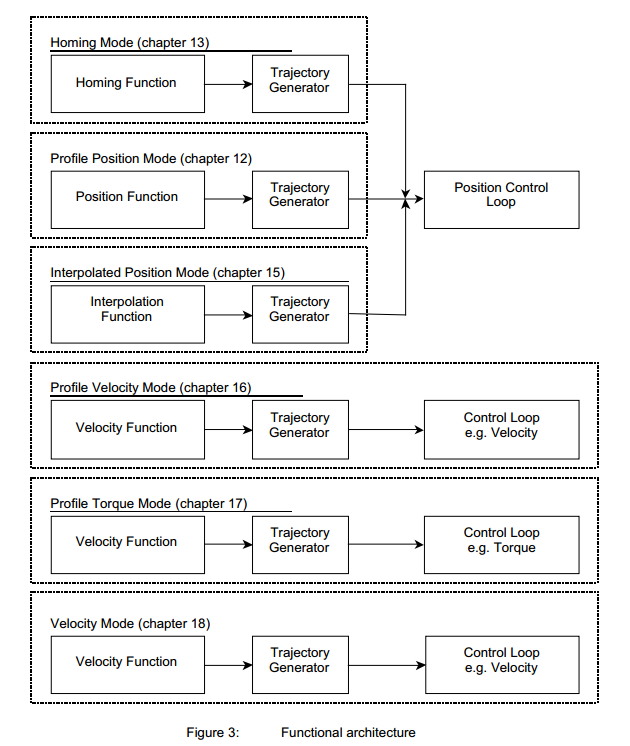
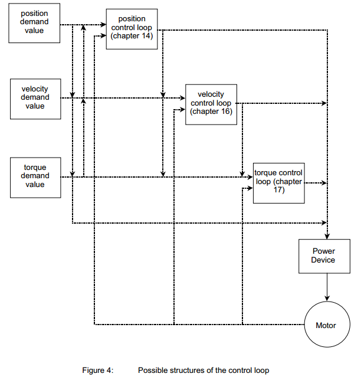

<!-- TOC -->

- [4. 概述](#4-概述)
    - [4.1. 访问驱动器](#41-访问驱动器)
    - [4.2. 驱动器架构](#42-驱动器架构)

<!-- /TOC -->

---
## 4. 概述
>OVERVIEW

### 	4.1. 访问驱动器 
>Access to the drive 

从CAN网络到驱动器的访问是通过数据对象进行的	
>The access from the CAN network to the drive is done through data objects.

---
***Data objects of the drive***
| PDO                            | SDO                    | IDO                                           |
| ------------------------------ | ---------------------- | --------------------------------------------- |
| Process Data Object            | Service Data Object    | Internal Data Object                          |
| described in chapters 9 to 18 | described in chapter 7 | manufacturer specific normally not accessible |

图1:驱动器数据对象
>Figure 1: Data objects of the drive

---

过程数据对象（PDO）：PDO是未经证实的服务中的消息（参见/3/）。 它们用于与驱动器之间传输实时数据。 PDO的传输速度很快，因为它们是在没有协议开销的情况下执行的，一个CAN帧中能够传输八个应用程序数据字节。 PDO中描述的对象字典中的条目对应第9章到第18章。数据类型和这些对象到PDO的映射在第7章中描述。
>Process Data Object (PDO): PDOs are messages in an unconfirmed service (see /3/). They are used for the transfer of real-time data to and from the drive. The transfer is fast, because it is performed with no protocol overhead what means to transport eight application data bytes in one CAN-frame. The PDOs correspond to entries in the object dictionary described in chapters 9 to 18. The data type and mapping of these objects into a PDO is described in chapter 7.

服务数据对象（SDO）：sdo是经过某种握手确认的服务中的消息（请参阅/3/）。 它们用于访问对象字典的条目。 特别的，这些对象完成了各种可能的应用程序的对于驱动器的请求行为的配置
>Service Data Object (SDO): SDOs are messages in a confirmed service with a kind of handshake (see /3/). They are used for the access to entries of the object dictionary. Especially the configuration for the requested behavior of the drive adapted to the various possible applications is done by these objects.

内部数据对象（IDO）：内部数据对象表示制造商和设备特定功能对此配置文件的适应。 通常情况下，这些对象不能被直接访问;但是制造商可以通过SDO服务授予用户访问IDO的权限。
>Internal Data Object (IDO): The internal data objects represent the adaptation of the manufacturer and device specific functionality to this profile. Normally these objects are not directly accessible;nevertheless a manufacturer can give the user access to the IDOs by SDO services.

### 	4.2. 驱动器架构 
>Architecture of the drive 

---

***Communication architecture***
  
图2.通讯体系结构
>Figure 2: Communication architecture

---

设备控制：执行驱动器的状态机启动和停止以及多个模式特定命令。 这将在第10章中介绍。特定模式的操作将在第12章到第18章中介绍。
>Device Control: The starting and stopping of the drive and several mode specific commands are executed by the state machine. This is described in chapter 10. The mode specific actions are described in chapter 12 to 18.

操作模式：操作模式定义驱动器的行为。 此配置文件中定义了以下模式:
>Modes of Operation: The operation mode defines the behavior of the drive. The following modes are defined in this profile:

+ 回原模式（第13章）
    + 本章介绍了查找原点位置的各种方法（也包括：参考点，原点，零点）。
    + >Homing mode (chapter 13)
    This chapter describes the various methods to find a home position (also: reference point,datum, zero point).

+ 规划位置模式（第12章）    
    + 在此模式下定义驱动器的位置。 可以限制速度，位置和加速度，也可以使用轨迹发生器进行规划化的移动。
    + >Profile position mode (chapter 12)
    The positioning of the drive is defined in this mode. Speed,position and acceleration can be limited and profiled moves using a Trajectory Generator are possible as well.

+ 插值位置模式（第15章）
    + 本章介绍了单轴的时间插补和协调轴的空间插补。同步机制和插值数据缓冲区也在本章介绍。
    + >Interpolated position mode (chapter 15)
    This chapter describes the time interpolation of single axles and the spatial interpolation of coordinated axles. Synchronization mechanisms and interpolation data buffers are covered by this chapter.
+ 规划速度模式（第16章）
    + 规划速度模式用于不需要特别考虑位置时控制驱动器的速度。 它提供限制功能和轨迹生成。
    + >Profile velocity mode (chapter 16)
    The Profile Velocity Mode is used to control the velocity of the drive with no special regard of the position. It supplies limit functions and Trajectory Generation.

+ 规划扭矩模式（第17章）
    + 在本章中，描述了扭矩控制所有相关参数。
    + >Profile torque mode (chapter 17)
    In this chapter the torque control with all related parameters is described. 

+ 速度模式（第18章）
    + 许多变频器使用这种简单模式来控制带有限制和斜坡功能的驱动器的速度。
    + >Velocity mode (chapter 18)
    Many frequency inverters use this simple mode to control the velocity of the drive with limits and ramp functions.

速度模式（第18章）与其他模式相当分离，并没有太多的干扰。因此，对象字典条目的命名与其他章节稍有不同。
>The velocity mode (chapter 18) is rather separated from the other modes and does not interfere with them so much. For this reason, the naming of object dictionary entries differs a little bit from the other chapters.

制造商在手册中承诺其设备支持哪些模式。
>The manufacturer commits in the manual which modes are supported by his device.

如果支持多个模式，则制造商还定义是否允许在驱动器运动时或仅能在驱动器停止时更改操作模式。
>If more than one mode is supported, then the manufacturer also defines whether the change of operation mode is allowed while the drive is moving or only when the drive is stopped.

---
***Functional architecture***

图3: 函数结构
>Figure 3: Functional architecture

---

>轨迹生成器：选择的操作模式和相应的参数（对象）定义了轨迹生成器的输入。轨迹发生器向控制回路提供需求值。它们通常是特定于模式的。
>Trajectory generator: The chosen operation mode and the corresponding parameters (objects) define the input of the trajectory generator. The trajectory generator supplies the control loop(s) with the demand values. They are generally mode specific.

每个模式都可以使用自己的轨迹生成器。第12章对其功能进行了一般性描述，与规划位置模式有关。
>Each mode may use its own trajectory generator. A general description of its functionality is given in chapter 12, which is related to the profile position mode

---
***Possible structures of the control loop***

图4: 控制回路的可能结构
>Figure 4: Possible structures of the control loop

---

控制循环：控制循环的实现是高度特定于制造商的，本概要中没有描述。可能的控制回路结构如上图所示。
>Control loop: The implementation of the control loop is highly manufacturer specific and not described in this profile. Possible control loop structures are shown in the picture above.

控制回路可以是开环或闭环，也可以是特定运行模式或固定运行模式。如果支持相应的模式并且它们是必需的，则必须实现第12章到第18章中描述的对象。但允许制造商在规划位置模式下使用速度控制器的对象；例如，控制回路结构包括产生速度需求值的位置控制器和将其用作需求值的速度控制器。
>The control loop can be open or closed and it can be operation mode specific or fixed. The objects which are described in chapter 12 to 18 must be implemented, if the corresponding mode is supported and if they are mandatory. But it is allowed that the manufacturer uses objects of the velocity controller in the profile position mode; for example the control loop structure consists of a position controller producing a velocity demand value and a velocity controller using this as a demand value.
